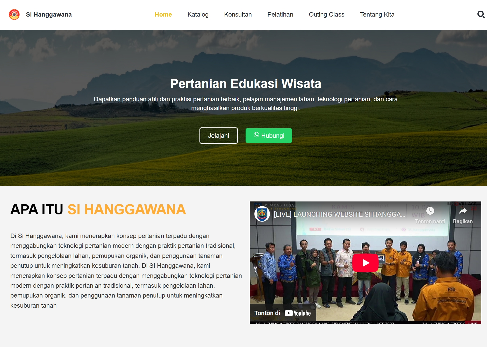

# Si-Hanggawana

 

Repository ini adalah bagian dari proyek **Si-Hanggawana** yang dikembangkan menggunakan **ReactJS**.
Dokumentasi ini menjelaskan **cara cloning dan menjalankan** proyek ini di lingkungan lokal Anda.

---



## 🚀 Fitur

- Menggunakan ReactJS
- Struktur proyek rapi
- Siap untuk dikembangkan lebih lanjut

---

## 📦 Cara Clone Repository

Ikuti langkah-langkah berikut untuk meng-clone dan menjalankan proyek:

### 1. Pastikan Anda Sudah Menginstall Git

Jika belum, Anda dapat mengunduh dan menginstalnya dari [Git Official Website](https://git-scm.com/downloads).

### 2. Clone Repository

Buka terminal atau command prompt, lalu jalankan perintah berikut:

```bash
git clone https://github.com/bungagana/Si-Hanggawana-React.git
```

### 3. Masuk ke Direktori Project

Pindah ke dalam folder project yang sudah di-clone:

```bash
cd Si-Hanggawana-React
```

### 4. Install Dependencies

Pastikan Anda sudah menginstall **Node.js** dan **npm**. Kalau belum, silakan install dari [Node.js Official Website](https://nodejs.org/).

Kemudian jalankan:

```bash
npm install
```

Ini akan mengunduh semua dependency yang diperlukan untuk menjalankan aplikasi.

### 5. Jalankan Aplikasi

Setelah instalasi selesai, jalankan:

```bash
npm start
```

Aplikasi akan otomatis terbuka di browser Anda di alamat:

```
http://localhost:3000
```

---

## ⚙️ Perintah Lain

- Untuk membuild aplikasi ke mode production:

```bash
npm run build
```

- Dokumentasi React resmi: [React Documentation](https://reactjs.org/)

---

## 📢 Catatan Penting

- Pastikan koneksi internet Anda stabil saat proses instalasi dependency.
- Jika mengalami error saat instalasi, coba jalankan:

```bash
npm cache clean --force
npm install
```

---

© 2024 Bungagana. All rights reserved.

